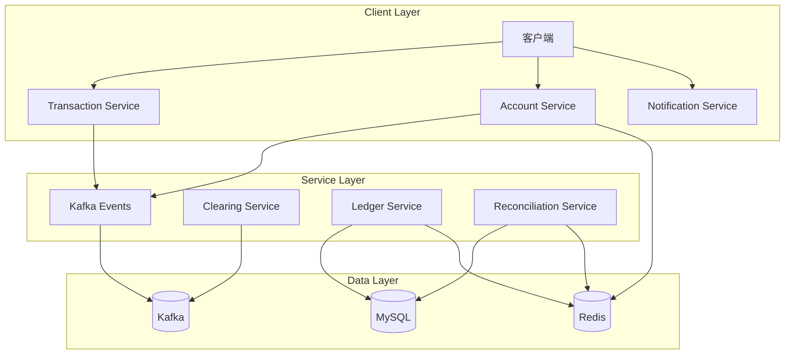
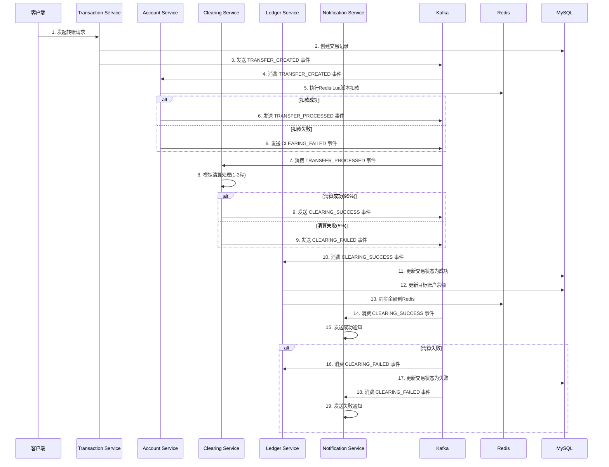
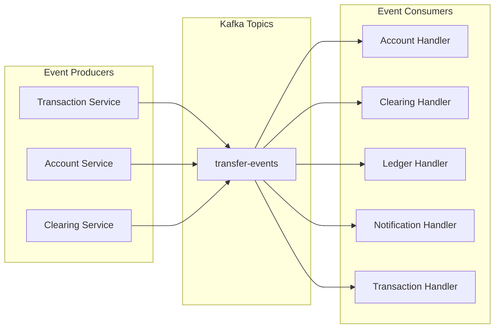
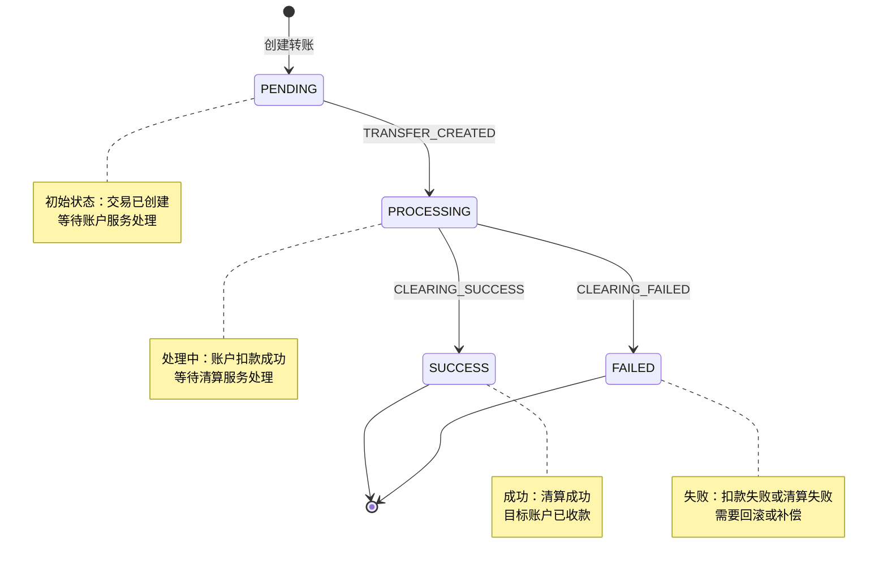
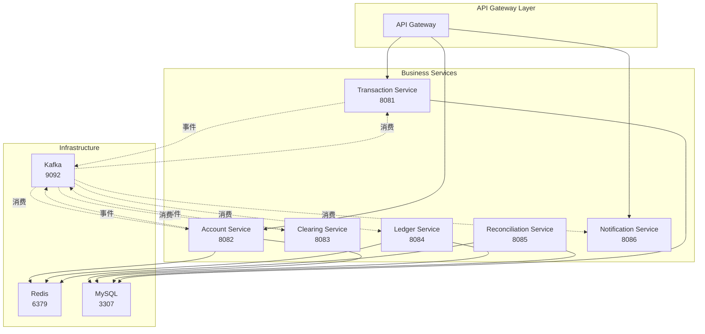
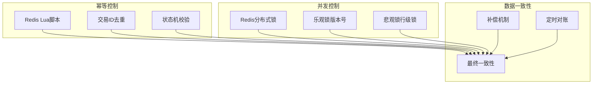
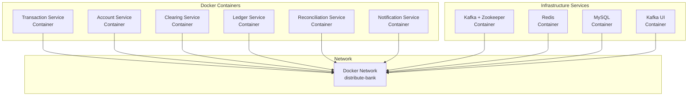

# 分布式银行转账系统架构流程图

## 系统整体架构

## 转账流程时序图

## 事件驱动架构图

## 事件类型和状态流转

## 微服务依赖关系

## 数据一致性保障

## 部署架构

## 关键特性说明

### 1. 事件驱动架构
- 使用Kafka作为消息中间件
- 服务间通过事件进行解耦
- 支持异步处理和水平扩展

### 2. 数据一致性
- Redis Lua脚本保证原子性
- 幂等处理防止重复消费
- 最终一致性模型

### 3. 高可用设计
- 微服务独立部署
- 容器化部署
- 服务间松耦合

### 4. 监控和运维
- 统一的日志记录
- 健康检查接口
- 可观测性设计 